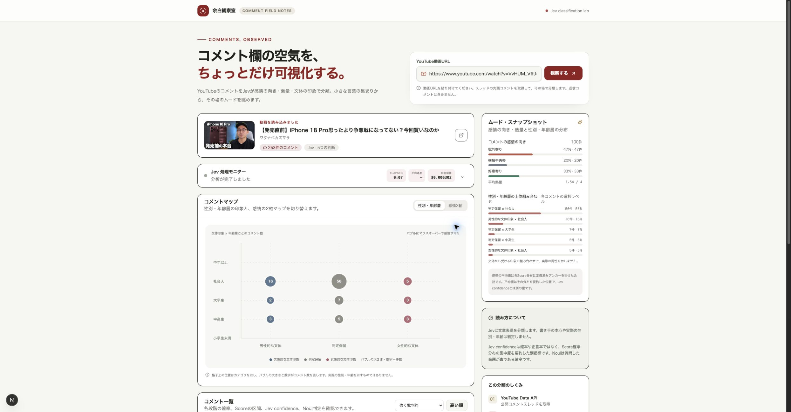
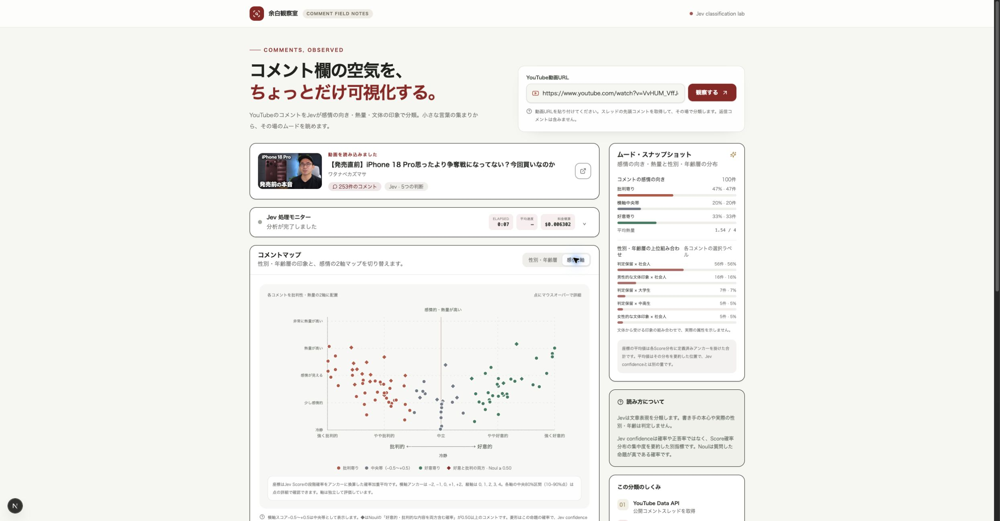
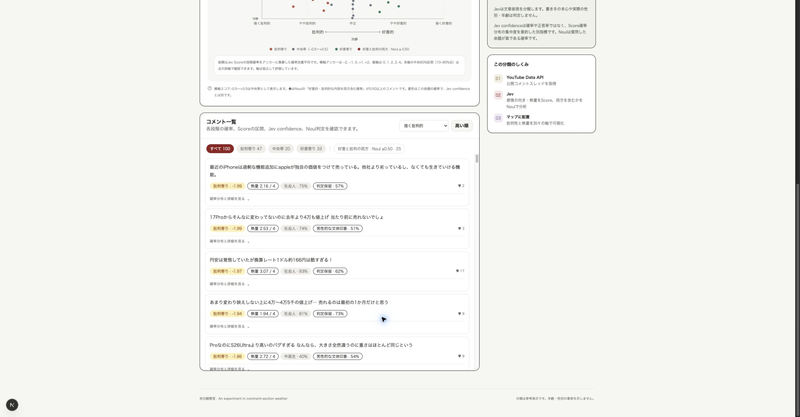
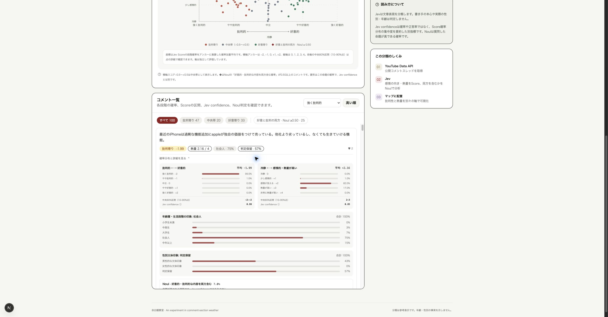
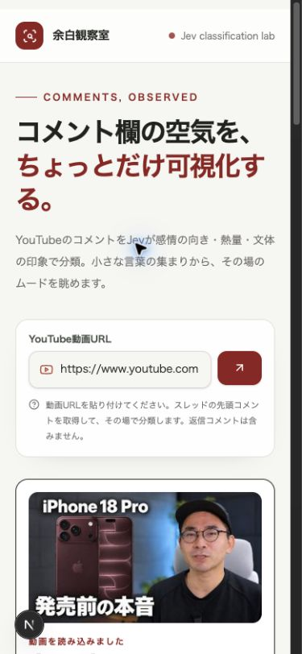
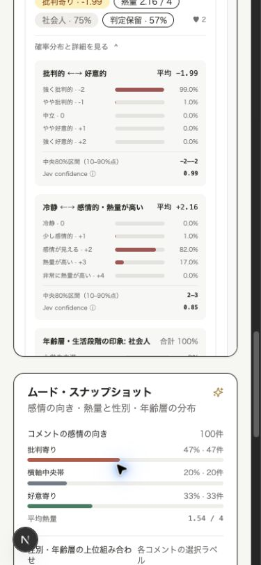
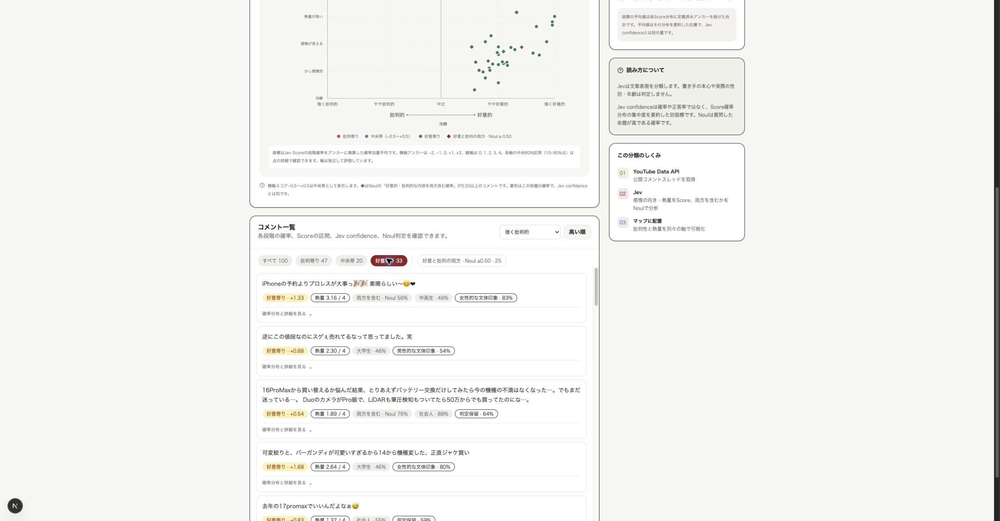

# 「余白観察室」批判的レビュー

2026年9月25日｜対象: Chromeで開いていた `http://localhost:3000/` の分析済み画面、および現行コード

## 結論

**現状は「コメント分類の実験画面」として成立しているが、「YouTubeコメントから示唆を引き出す道具」としては未完成。** コメントの取得、5種類の分類、逐次表示、分布と個別結果の確認はできる。一方で、ユーザーが知りたい「何が評価・批判され、なぜそう言われ、次に何を検討すべきか」が出力されない。100件を読んで意味をまとめる仕事は、依然として人間に残っている。

フロントエンドの弱さは、単なる配色や装飾の問題ではない。**重要度の順序が逆転している。** 結果画面の主役は文体印象と年齢層のバブル図で、価格への不満、買い替えの理由、製品への質問といった意思決定に役立つ内容は長いコメント一覧の中に埋もれる。小さい文字、似た強さのカード、専門用語の多さが探索負荷を増やしている。

### 評価の範囲と限界

- 実際に開かれていた動画は「【発売直前】iPhone 18 Pro思ったより争奪戦になってない？今回買いなのか」。画面には動画のコメント数253件、分析済み100件が表示されていた。
- Chromeのデスクトップ表示と390px指定のモバイル表示を確認した。既存の分析結果を保つため、再分析や全件分析は実行していない。URLエラー、分析中、件数選択ダイアログ、通信失敗はコードからのみ確認した。
- 分類の正解率は測定していない。以下の誤分類例は、画面に見える原文とラベルを照らした「要再確認の例」であり、統計的な性能評価ではない。
- スクリーンショットだけでアクセシビリティ適合を断定していない。操作不能の懸念は画面とイベント実装の両方で確認した。

## 観察した操作と画面

| Step | 操作・状態 | 状態 | 画面 |
|---|---|---|---|
| 1 | URL入力済み、動画・分析結果の概要を表示 | 一部良好。入口は明快だが、分析対象100件と動画全体253件の関係が目立たない | [01 概要](./01-overview.jpg) |
| 2 | 「感情2軸」へ切替 | 一部良好。分布は把握できるが、点の意味を知るにはマウス操作が必要 | [02 感情マップ](./02-emotion-map.jpg) |
| 3 | コメント一覧へ移動 | 要改善。原文を読めるが、論点別に束ねられていない | [03 コメント一覧](./03-comment-list.jpg) |
| 4 | 1件の確率分布を展開 | 分類検証には良好。示唆を得る目的には情報量が過大 | [04 分類詳細](./04-comment-detail.jpg) |
| 5 | モバイルの冒頭を確認 | 要改善。主要ボタンは矢印だけになり、目的が伝わりにくい | [05 モバイル冒頭](./05-mobile-top.jpg) |
| 6 | モバイルの結果を確認 | 要改善。マップは横スクロール、詳細は長い縦スクロールになる | [06 モバイル結果](./06-mobile-list.jpg) |
| 7 | 「好意寄り」で絞り込み | 動作は良好。ただし分類ラベルと話題の意味が混ざり、分類結果だけでは理由を読めない | [07 絞り込み](./07-filtered-comments.jpg) |

### 画面キャプチャ（操作順）

**1. 概要**



**2. 感情2軸マップ**



**3. コメント一覧**



**4. 分類の詳細**



**5. モバイルの冒頭**



**6. モバイルの結果**



**7. 好意寄りで絞り込み**



## 機能面の所見

| 優先度 | 所見と根拠 | 示唆への影響 | 改善案 |
|---|---|---|---|
| **P0** | 分類は「批判↔好意」「熱量」「両面」「文体印象」「年齢層印象」の5判断に限られる。[分類の質問定義](../../lib/jev.ts#L54) を見ても、話題・理由・要望・購入障壁は抽出していない。 | 画面の47%批判寄りという数字から、価格、17との差、電池、USB-C、カメラなど、何を変えるべきかへ進めない。 | 「論点・主張・理由・要望・質問」を抽出し、似たコメントをテーマに束ねる。テーマごとに件数、異なる見方、代表原文、次の検証事項を表示する。 |
| **P0** | 分析対象は関連度順の先頭100件か全件で、返信を含まない。[取得処理](../../lib/youtube.ts#L26) と[一覧](../../app/page.tsx#L188) では、結果の母数・抽出方法・取得時点を常時明示していない。 | 「批判寄り47%」がコメント欄全体の割合に見えやすい。関連度順は無作為抽出ではなく、返信の文脈も失う。 | 結果の直上に「分析100件／動画表示253件、関連度順、先頭コメントのみ、取得日時、失敗件数」を固定表示。全件・新着順・期間指定を比較できるようにする。 |
| **P0** | ラベルの対象が曖昧。分類指示は「コメント本文が表す評価の向き」だが、製品・動画・投稿者・他コメントのどれへの評価かは区別しない。[分類定義](../../lib/jev.ts#L55) | 画面では「去年の17promaxでいいんだよなぁ😅」や「俺は単純に来年のiPhone20への期待が高いから今回はパス」が好意寄りに表示された。また「iPhoneの予約よりプロレスが大事っ…素晴らしい」が両面判定に入る。購入意向や製品評価として読むと誤る。 | まず「評価対象」と「発話タイプ」を判定し、対象外・冗談・質問を別にする。購入意向と製品評価は独立項目にする。人手確認用の「要確認」欄を用意する。 |
| **P1** | 分析済みコメントをテーマ検索、原文リンク、メモ、引用、共有・書き出しで再利用できない。[一覧実装](../../app/page.tsx#L182) は確率ソートと感情フィルタが中心。 | 気づきを得ても証拠を集め直す必要があり、会議資料や改善タスクへつながりにくい。 | キーワード検索、テーマ・対象・日付・いいねで絞り込み。各コメントにYouTube原文へのリンクと引用コピー。根拠付きの要約をMarkdown/CSVで書き出す。 |
| **P1** | 処理が完了するとモニターが閉じ、失敗件数は展開時のみ見える。[画面処理](../../app/page.tsx#L127)・[モニター](../../app/page.tsx#L161) | 「完了」と見えても何件が分類されなかったか、割合の母数は何かを見落とす。 | 完了カードに「取得・成功・失敗・対象外」を常時表示し、失敗時は再試行と部分結果の明示をする。 |
| **P2** | 表示される「料金概算」は入力トークンだけで計算する。[費用計算](../../app/api/classify/route.ts#L7) | この画面だけでは総費用と誤読されうる。 | 「推定入力料金」と明記し、実際の課金条件を設定側で管理する。全件分析前には件数と概算範囲を示す。 |

### この動画で本来見えたい示唆の例

以下は画面に見えた原文を人が読んで整理した**仮説**であり、アプリが生成した分析結果ではない。

1. **購入障壁**: 値上げへの反発と、前世代からの変化を感じにくいという声が重なる。
2. **買い替えのきっかけ**: 古い機種の電池・容量・Lightning端子からの移行が購入を後押ししている。
3. **評価が割れる機能**: 可変絞りには関心がある一方、一般用途には不要という声もある。

有用な成果物は、このような主張ごとに「何件に見られたか」「反例は何か」「どの原文が根拠か」を検証できる形で示すべき。

## フロントエンドデザインの所見

| 優先度 | 問題 | 根拠 | 具体的な変更 |
|---|---|---|---|
| **P0** | 最上位の視覚要素が目的とずれている | Step 1で最大の面積を文体×年齢層マップが占める。年齢・性別は推定事実ではないとの注記もある。主目的の「示唆」は存在しない。 | 結果の最上段を「主要テーマ3〜5件＋根拠＋次の問い」に変える。マップは「分布」タブに移し、初期タブは論点一覧にする。 |
| **P0** | 情報の強弱が弱い | Step 1〜4でカードの枠線・余白・見出しがほぼ同じ。分析監視、図、確率詳細、コメントが同格に見える。 | 1画面目は「今回わかったこと」「分析範囲」「確認が必要な点」の3層に絞る。処理速度・API説明・確率の内訳は折りたたむ。 |
| **P0** | モバイルで主操作とグラフが弱い | Step 5では「観察する」の文字が非表示で矢印のみ。モバイルのアクセシビリティツリーでも、このボタンに名前がない。[ボタン実装](../../app/page.tsx#L156)。マップは最小幅620/650pxで横スクロール。[マップ実装](../../app/page.tsx#L166) | モバイルボタンを「分析する」と常時表示し、明確なアクセシブル名を付ける。小画面では横スクロール図をサマリー・テーマカード・タップ可能な分布に置き換える。 |
| **P1** | 極小文字と専門用語が読み取りを妨げる | 図の凡例、補足、確率詳細に9〜11px指定が多い。Step 4は小さな数字とバーが密集。「Jev」「Score」「Noul」「confidence」が同じ画面に連続する。 | 本文14〜16px、補助12px以上を基本とする。「批判の強さ」「判定の曖昧さ」のような日本語を前面に出し、技術用語は詳細に置く。 |
| **P1** | 色だけに意味を載せ、図の操作がマウス依存 | 点とバブルに `onMouseEnter/Move/Leave` のみがあり、キーボード・タップで詳細を開く実装がない。[点の実装](../../app/page.tsx#L172) | 点やバブルをフォーカス可能にして Enter/Space/タップで詳細を開く。図の下に同じ内容を読める表を置く。色以外にラベル・形・件数で識別する。 |
| **P1** | フィルタと図の関係がわかりにくい | Step 7で「好意寄り」を選ぶと図も絞られるが、フィルタはコメント一覧の内側にある。[図の適用](../../app/page.tsx#L172)、[フィルタ](../../app/page.tsx#L183) | 図と一覧を同じ「探索」領域に収め、共通フィルタをその上に配置。適用中の条件と表示件数を明示する。 |
| **P2** | 余白と装飾の使い方が分析作業に合っていない | Step 1で大きいキャッチコピー、英語の装飾文、複数の説明カードが結果より前にある。広いデスクトップでは中央の情報密度が低く、下方の一覧まで視線が遠い。 | 分析後はヒーローを小さく畳み、動画名・分析範囲・再分析を1行のヘッダーにする。空いた領域をテーマ、引用、比較に使う。 |

### 推奨する結果画面の構成

```text
動画名 / 分析範囲 / 取得時点 / 再分析
────────────────────────────────────────
今回の主な示唆  [購入障壁] [期待] [よくある質問]
各カード: 主張1文、件数、代表コメント、反例、検証メモ
────────────────────────────────────────
テーマ一覧                根拠コメント
価格 / 進化不足 / カメラ…  検索・絞込・原文リンク
────────────────────────────────────────
分布・分類の詳細（必要時に開く）
```

### 見た目の方向性

- 「観察室」というブランドは残してよい。ただし結果画面は編集記事風ではなく、読みやすい調査ワークスペースとして設計する。
- 背景は1色、カード境界は最小限。色は「批判」「好意」「要確認」など意味がある場所に集中させる。
- 1行で読める見出しと短い要約を優先し、補足の説明は必要な場所にだけ出す。
- デスクトップは主列にテーマと引用、右列に分析範囲・注意点。モバイルは1列で「結論→根拠→詳細」の順にする。

## 改善の順番と受け入れ条件

| 段階 | 実施内容 | 受け入れ条件 |
|---|---|---|
| 1. 基盤 | 分析範囲の明示、成功/失敗件数、評価対象の切り分け、要確認判定 | 100/全件・取得方法・失敗数が結果冒頭でわかり、製品以外への賛辞が製品好意に混ざらない |
| 2. 示唆 | テーマ抽出、代表原文、反例、検索・原文リンク | 初見の利用者が一覧100件を読まずに「主要な購入障壁と期待」を3分以内に説明でき、各主張の根拠に到達できる |
| 3. 画面刷新 | 結果先頭を示唆中心に再構成、文字サイズ・密度・モバイル操作を改善 | 390px幅で主要操作の名称が見え、横スクロールなしで主な結果を読める。キーボードでも図の情報に到達できる |
| 4. 活用 | 書き出し、期間・動画間比較、ラベル修正 | 同じ条件で再実行した比較を説明でき、引用付きのレポートを再利用できる |

## 良い点

- URLから動画情報を確認し、100件超で分析範囲を選ばせる流れは明確。
- 逐次配信により、分析中も結果が増えていく。件数・所要時間・失敗数を扱う土台がある。
- 原文、確率分布、Noul、Jev confidenceを区別して表示し、属性の事実推定ではないと説明している。
- 感情フィルタと確率ソートは、分類器の挙動を調べる用途には役立つ。

## 検証が残る点

- 初回ロード、100件/全件の選択、分析中、APIエラー、再試行の実画面は未確認。
- スクリーンリーダー、キーボードのみの一連操作、200%拡大、実機タッチ操作は未実施。
- 分類性能は正解ラベル付きデータで評価する必要がある。特に「評価対象」「皮肉」「質問」「購入意向」を分けたサンプルを用意したい。
