# 余白観察室 フロントエンドデザインレビュー

2026-09-26。対象はこのリポジトリのローカル版。画面幅約778pxで入口・エラー・分析範囲選択を、約1265pxで結果画面を確認した。初回レビューでは8件のローカルサンプルを使用し、その後、ユーザーの許可を得て実動画の関連度順・先頭100件だけを分析した。

## 総評

落ち着いた配色と余白で、URL入力の入口は明快。実分析では件数、進捗、速度、料金概算が更新され、100件を完了した。マップ、絞り込み、コメントごとの確率詳細も機能した。一方、分析範囲をキャンセルした後の空画面、結果の母数・抽出条件の見えにくさ、完了後に平均速度が消えること、小さい文字とマップのマウス依存が主な改善点。

## 確認したステップ

| # | ステップ | 状態 | 画面 |
|---|---|---|---|
| 1 | URL入力の初期画面 | 良好。主操作が明確 | [01 初期画面](./01-start.png) |
| 2 | 無効なURLを入力 | 一部良好。エラーは表示されるが回復案内が弱い | [02 入力エラー](./02-invalid-url.png) |
| 3 | 100件超の動画を確認 | 要改善。大量処理が強調される | [03 範囲選択](./03-scope-dialog.png) |
| 4 | 範囲選択をキャンセル | 要改善。空の分析画面が残る | [04 キャンセル後](./04-after-cancel.png) |
| 5 | サンプル8件の分析結果を見る | 一部良好。概要と分類条件の接続が弱い | [05 結果概要](./05-sample-results.png) |
| 6 | 文体印象・感情マップを切り替える | 要改善。点が小さく詳細はマウス依存 | [06 文体印象](./06-demographic-map.png)・[07 感情2軸](./07-emotion-map.png)・[08 凡例](./08-comments-list.png) |
| 7 | 一覧を絞り込み、確率詳細を開く | 一部良好。情報密度が高い | [09 一覧](./09-comments-cards.png)・[10 詳細](./10-comment-detail.png)・[11 絞り込み](./11-filtered-comments.png) |
| 8 | 実動画の先頭100件を分析中 | 良好。件数、速度、料金概算が逐次更新される | [12 実分析の進捗](./12-live-progress.png) |
| 9 | 100件の分析完了と処理モニター | 一部良好。100/100と料金は残るが平均速度は消える | [13 完了概要](./13-live-complete.png)・[14 モニター](./14-live-monitor-expanded.png)・[15 モニター詳細](./15-live-monitor-map.png) |
| 10 | 実データの感情マップ | 一部良好。分布は見えるが重なる点の詳細確認は難しい | [16 実データの感情マップ](./16-live-emotion-map.png) |
| 11 | 実データのコメント一覧 | 要改善。評価対象が異なる批判を動画評価と誤読しやすい | [17 実データの一覧](./17-live-comments.png) |

### 画面記録

Step 1 — URL入力

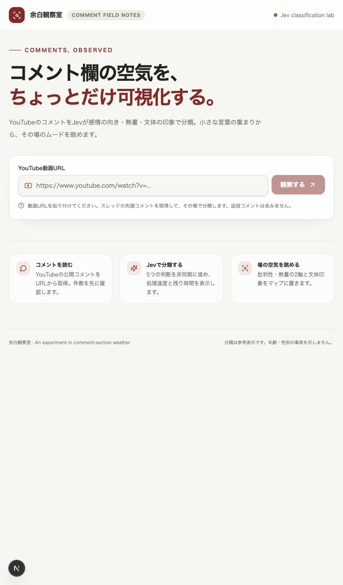

Step 2 — 入力エラー

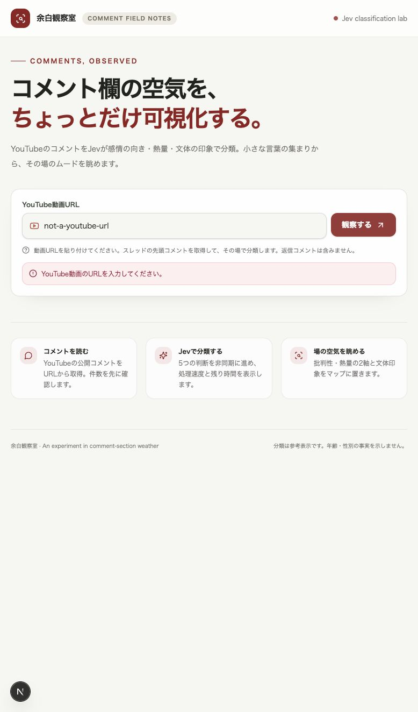

Step 3 — 分析範囲の選択

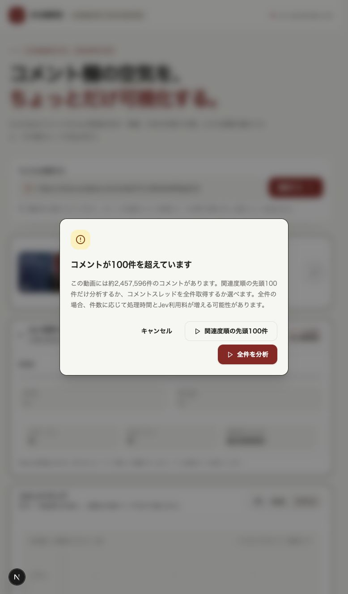

Step 4 — キャンセル後

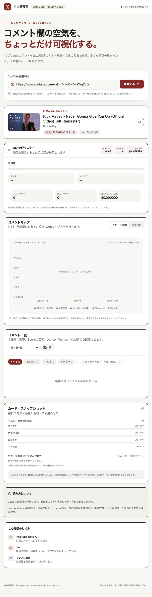

Step 5 — 結果概要（サンプルデータ）

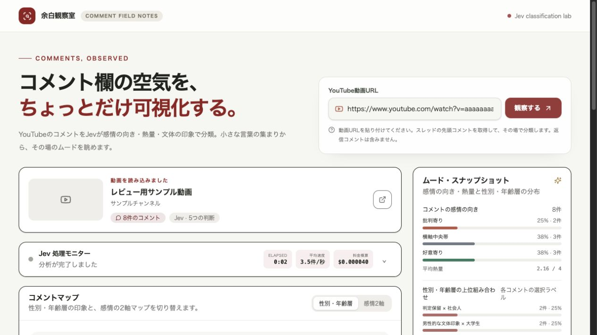

Step 6 — マップ（サンプルデータ）

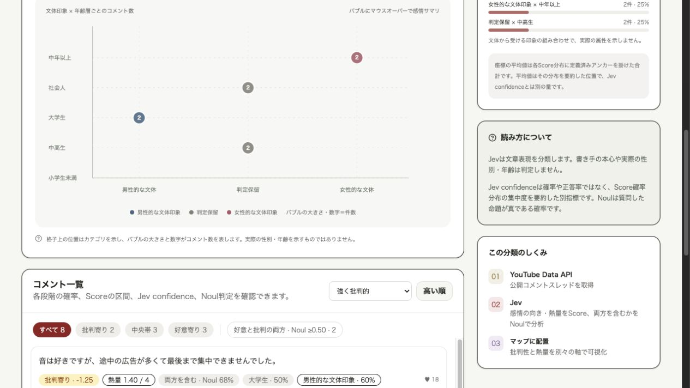
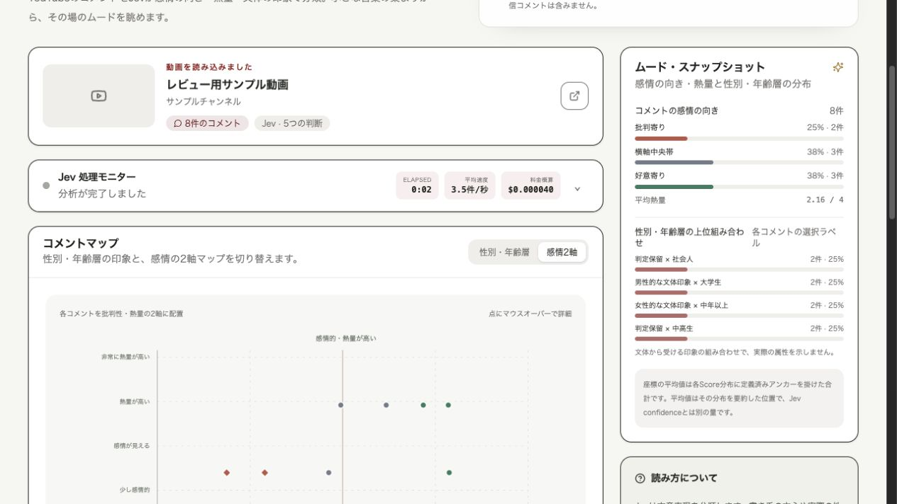

Step 7 — コメント確認（サンプルデータ）

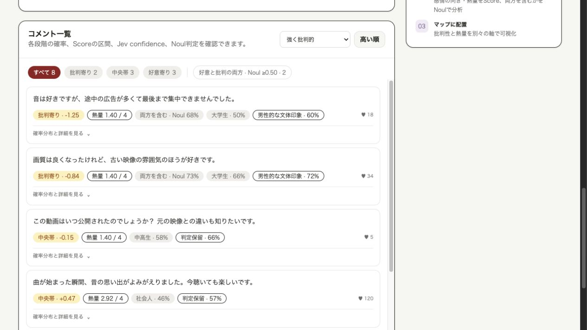
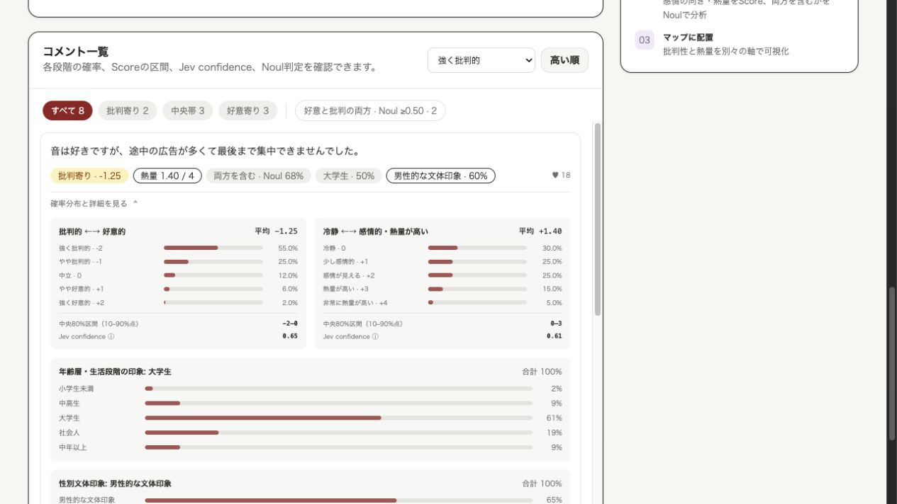
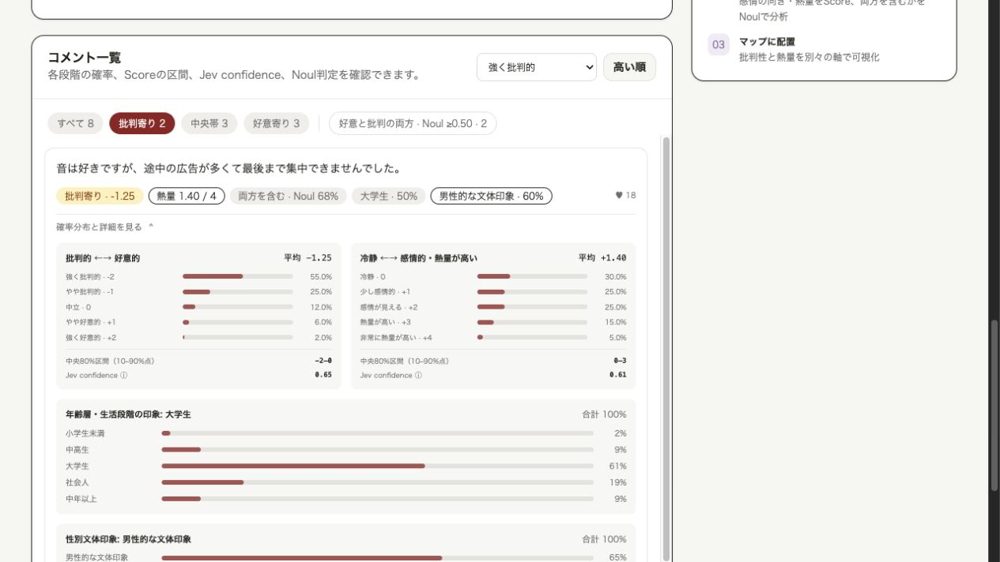

Step 8 — 先頭100件の実分析中

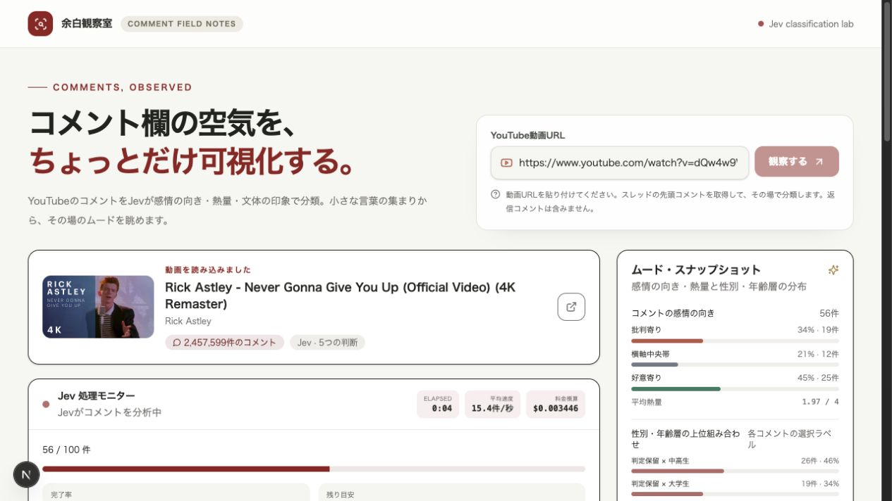

Step 9 — 実分析の完了

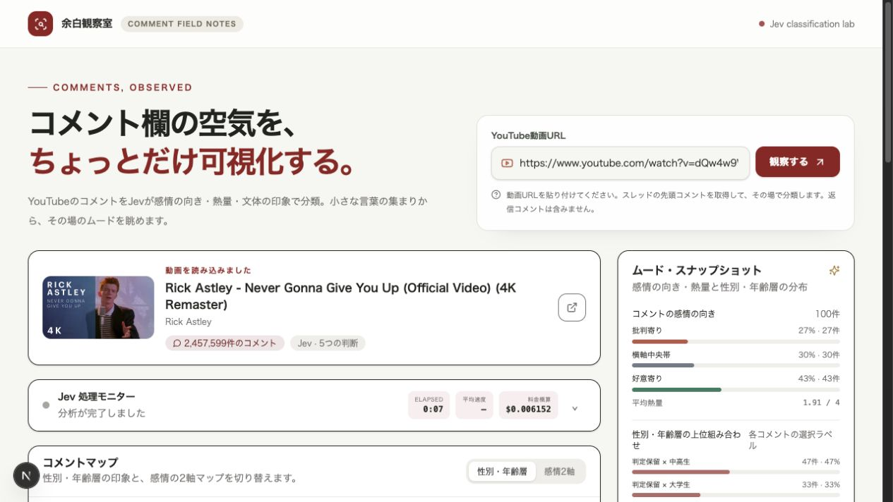
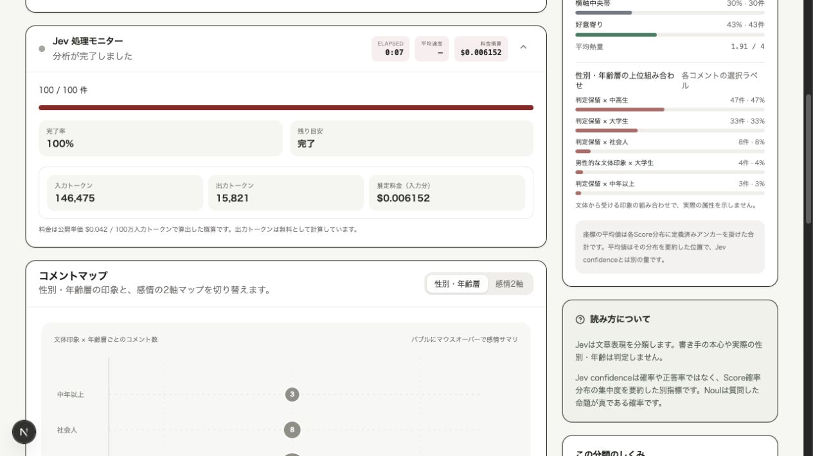

Step 10 — 実データの感情マップ

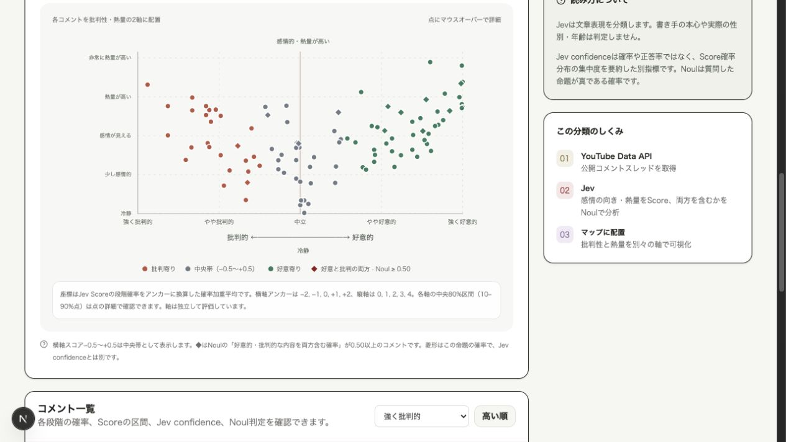

Step 11 — 実データのコメント一覧

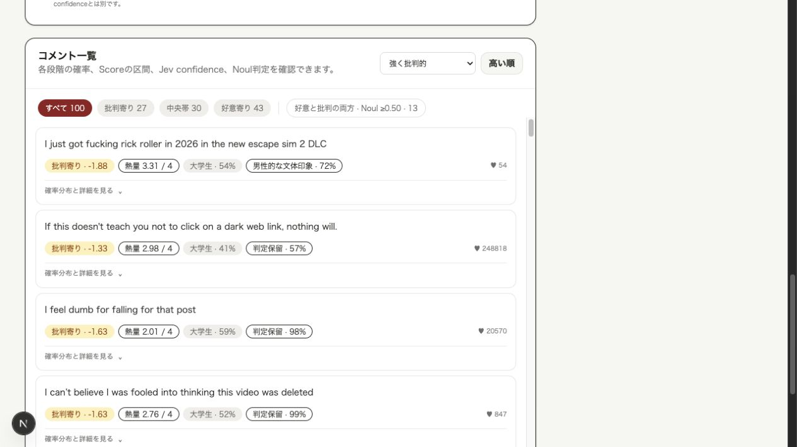

## 優先して直したい点

1. **P1：キャンセル後の状態を整理する。** [Step 4](./04-after-cancel.png)では動画を読み込んだだけで、処理モニター、空のマップ、0件の一覧、0%の分布まで表示される。選択をキャンセルした場合は動画情報と「分析範囲を選ぶ」ボタンを残し、未分析の部品は見せない。URLを再送信しなくても選択を再開できるようにする。
2. **P1：結果の対象範囲を常時表示する。** [Step 9](./13-live-complete.png)では動画全体の約245万件と、右側の結果100件が別々に表示される。先頭100件・関連度順・返信の除外・取得時刻が結果見出しにまとまっておらず、27%・43%などの割合を動画全体の傾向と誤読し得る。「分析100件／動画全体約245万件、関連度順、先頭コメントのみ」を結果の直上に表示する。
3. **P1：マップの詳細をキーボードとタッチでも開けるようにする。** [Step 6](./07-emotion-map.png)では点が小さく、説明も「マウスオーバー」となっている。コード上、点・バブルには `onMouseEnter` 等だけがあり、フォーカス、クリック、タッチ操作がない。各点をフォーカス可能にして詳細を表示するか、マップと同期した選択可能な一覧を設ける。点が重なる場合の選択方法も必要。
4. **P1：完了後も平均速度を残す。** [Step 8](./12-live-progress.png)では15.4件/秒だったが、[Step 9](./13-live-complete.png)では「—」へ戻った。完了イベントに速度が含まれず、フロントエンドが0に上書きするため。完了時の値を保持するか、件数と経過時間から計算する。
5. **P1：感情の評価対象を明示する。** [Step 11](./17-live-comments.png)では「リンクをクリックしてだまされた」「別のリンクだと思った」といった内容が「批判寄り」に並ぶ。これは曲や動画への批判とは限らない。概要の「批判寄り27%」を動画評価として読ませないよう、何への評価かを区別するラベル、または「コメント本文の表現上の向き」という強い注記が必要。
6. **P2：小さい文字と薄い文字を見直す。** [Step 6–7](./08-comments-list.png)の軸、凡例、注釈、確率詳細は10–11pxが多い。テーマの `#7c7977` は白地で約4.32:1、軸の `#818981` は `#f8f9f6` 上で約3.41:1。通常サイズの文字に求められる4.5:1を下回る組み合わせがある。[WCAG 2.2 のコントラスト基準](https://www.w3.org/TR/wcag/#contrast-minimum)を目安に、文字サイズと色を調整する。
7. **P2：先に結論、後で詳細を読める構成にする。** [Step 5–7](./05-sample-results.png)では結果の前に大きな見出しが残り、各コメントには複数の数値ラベルが並ぶ。分析後は入力部分をコンパクトにし、件数と主要な傾向を上部にまとめる。コメントカードは本文・向き・熱量を先に見せ、文体印象と確率分布は展開時に読めるようにする。
8. **P2：入力エラーを欄に結び付ける。** [Step 2](./02-invalid-url.png)は `role="alert"` でエラーを通知できるが、入力欄に `aria-invalid` と `aria-describedby` がない。許容するYouTube URLの例を示し、エラー後に入力欄へ戻れるようにする。
9. **P2：大量分析の選択を安全に読める形にする。** [Step 3](./03-scope-dialog.png)では「全件を分析」が最も目立つボタンで、今回の実動画では約245万件だった。件数に応じた所要時間・料金の見積もりがないため、先頭100件を推奨として強調し、全件を選ぶ場合は見積もりを見せる。

## 良かった点

- [Step 1](./01-start.png)：URL入力、操作ボタン、取得対象の説明が一箇所にまとまっている。
- [Step 3](./03-scope-dialog.png)：100件を超える場合に範囲を選ばせ、全件で時間・料金が増える可能性を知らせている。
- [Step 7](./10-comment-detail.png)：コメント本文から段階確率まで追える。文体印象を実際の属性と混同しない注意書きもある。
- [Step 8–9](./12-live-progress.png)：100件の処理中に進捗と料金概算が更新された。完了時は100/100件、経過7秒、入力146,475トークン、料金概算$0.006152が表示された。これは画面の概算値で、請求額ではない。

## 確認範囲と残る検証

初回レビュー時は、外部APIへのコメント送信と利用料の可能性があるとして実分析が自動承認レビューで却下された。その後、ユーザーが先頭100件モードに限って許可したため、同モードを1回実行した。サンプル結果のスクリーンショットと実データのスクリーンショットは明記して区別している。実データは関連度順の先頭100件で、返信を含まないため、動画全体を代表する標本ではない。分類の正しさ自体も人手評価していない。ブラウザーのモバイル幅変更機能が使えず、スマートフォン幅、タッチ、ズーム、スクリーンリーダーの動作は未検証。アクセシビリティについては画面と実装から確認できたリスクを述べており、適合判定ではない。

## 次のステップ

まずキャンセル後の状態、結果の対象範囲、完了後の平均速度を直し、次に評価対象の説明とマップ操作を改善する。スマートフォン幅と支援技術での検証は別途行う。
